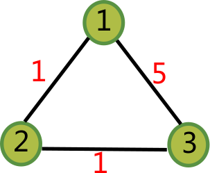

[](https://ci.appveyor.com/project/zhaofeng-shu33/principal-sequence-of-partition)
[](https://travis-ci.com/zhaofeng-shu33/principal_sequence_of_partition/)
# Introduction
This repo contains code to compute the principal sequence of partition for Dilworth truncation function.
Currently, two methods are available:

1. Dilworth truncation based on graph maximal flow
2. using paramatric maximal flow

Both method relies on [LEMON](https://lemon.cs.elte.hu/trac/lemon) Library to compute maximal flow for graph.

# How to build

## Dependencies

* LEMON (required)
* boost (boost-program-options is highly recommanded for the executable program while python binding requires boost-python)
* gtest (optional)

We provide a way to compile without any dependencies (you can get an executable). But this method uses brute force search and has limited command line argument
parsing capacity. To quickly try this way, invoke cmake with `-DUSE_LEMON=OFF -DUSE_BOOST_OPTION=OFF`.
You can use your operating system package manager to install the above dependencies.

It is tested you need g++ version >= 6.0 to compile the source code.

## CMake
This project uses [CMake](https://cmake.org) build system. We recommand out of source build. From project root directory,
```shell
mkdir build
cd build
cmake ..
```
If any error occurs, you should fix the dependencies first.

### with LEMON
We provide a naive brute force search method to solve submodualr function minimization(SFM) problem. For set with more than 10 elements, it is impractical. We use graph maximal flow(MF) to solve the special SFM problem. MF requires [lemon](https://lemon.cs.elte.hu/trac/lemon) library, which is disabled by default. To enable it, run `cmake` with `-DUSE_LEMON=ON`. 

This library is included in Ubuntu from 18.04, see [liblemon-dev](https://packages.ubuntu.com/bionic/liblemon-dev).

### with boost
This project uses boost library in two places. Firstly, the `main.cpp` uses *boost-option* to parse command-line arguments. This feature is optional but highly recommanded, and enabled by default. To disable it, run `cmake` with `-DUSE_BOOST_OPTION=OFF`. Secondly, *boost-python* is used to make the procedure callable from Python.
Disabled by default, to use it invoke cmake with `-DUSE_PYTHON=ON`.

### with GTest
Testing is disabled by default, which requires gtest library. To enable it, run `cmake` with `-DENABLE_TESTING=ON`


# Python binding
[](https://pypi.org/project/info_cluster)
Disabled by default. The binding requires boost-python library. To enable it, run `cmake` with `-DUSE_PYTHON=ON`
To make it independent of boost dynamic library, static linking should be enabled in CMAKE configuration.
To package the library, use `python setup.py bdist_wheel`.
Install the package by `pip install info_cluster`, below is the prebuild
binary packages:

| Platform | py3.6 | py3.7 |
| -------- | :---: | :---: |
| Windows  |   T   |       |
| MacOS    |       |       |
| Linux    |       |       |

## Demo code

We provide a high-level wrapper of info-clustering algorithm. 
After installing `info_cluster`, you can use it as follows:
```Python
from info_cluster import InfoCluster
import networkx as nx
g = nx.Graph() # undirected graph
g.add_edge(0, 1, weight=1)
g.add_edge(1, 2, weight=1)
g.add_edge(0, 2, weight=5)
ic = InfoCluster(affinity='precomputed') # use precomputed graph structure
ic.fit(g)
ic.print_hierachical_tree()
```
The output is like
```shell
      /-0
   /-|
--|   \-2
  |
   \-1
```
```Python
import psp # classify the three data points shown in the above figure
g = psp.PyGraph(3, [(0,1,1),(1,2,1),(0,2,5)]) # index started from zero, similarity is 5 for vertex 0 and 2
g.run() # use maximal flow algorithm to classify them
print(g.get_critical_values()) # [2,5]
print(g.get_category(2)) # get the result which has at least 2 categories, which is [1,0,1]
```    
## Further experiment
In the directory utility, we make two simple experiments. The first is `plot_art.py`, 
which plots the clustering results for two artificial datasets.
The second one is `empirical_compare.py`, which tests the info-clustering algorithm on 5 datasets
and compare the results with *kmeans*, *affinity propagation*, *spectral clustering* and *agglomerative clustering*.
For more detail, see [experiment](utility/README.md).

## Parametric Dilworth Truncation(pdt) implementation
We provide another alternative implementation, which can be used similar to **PyGraph**.
```Python
import psp
g = psp.PyGraphPDT(3, [(0,1,1),(1,2,1),(0,2,5)]) # index started from zero, similarity is 5 for vertex 0 and 2
g.run() # use maximal flow algorithm to classify them
print(g.get_critical_values()) # [2,5]
print(g.get_category(2)) # get the result which has at least 2 categories, which is [0,1,0]
```  

# Reference
1. [2016] Info-Clustering: A Mathematical Theory for Data Clustering
1. [https://github.com/ktrmnm/SFM](https://github.com/ktrmnm/SFM)
1. [2010] A Faster Algorithm for Computing the Principal Sequence of Partitions of a Graph
1. [2017] Info-Clustering: An Efficient Algorithm by Network Information Flow

# Contributing
See [contributing.md](./contributing.md)

# ChangeLog
* Version 1.1: expose `Gaussian2DGraph` (C++) class, which can be used directly in python.
* Version 1.2: expose `PyGraph` (C++) class, which is high customizable in python.
* Version 1.3: expose `PyGraphPDT` (C++) class, which has similar api as `PyGraph` but different inner implementation.