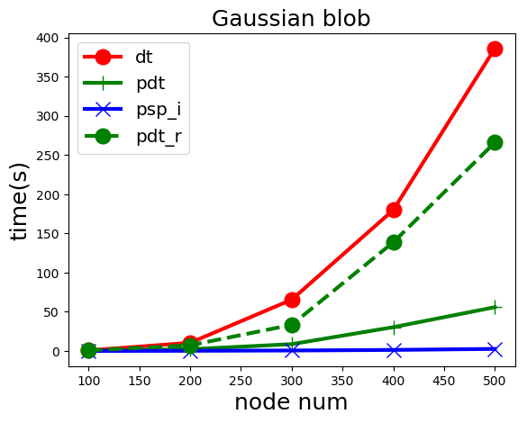

Algorithm Detail
================

Four algorithms are provided:

==========     ================     =================
Class Name      First Proposer      Time Complexity
==========     ================     =================
``DT``         :cite:`1991:dt`      :math:`O(n^2\textrm{MaxFlow}(n))`
``PDT_R``      :cite:`2010:psp`     :math:`O(n\textrm{MaxFlow}(n))`
``PDT``        ours                 :math:`O(n\textrm{MaxFlow}(n))`
``PSP_I``      ours                 :math:`O(n\textrm{MaxFlow}(n))`
==========     ================     =================

Though the last three algorithms have the same level of time complexity, empirically their efficiency
are different. The following picture shows the time used to get the psp structure of a dense 
graph :math:`|E|=O(|V|^2)` generated by Gaussian blob.

