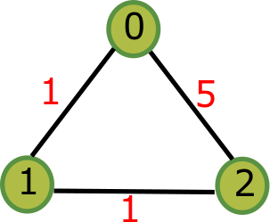

How to use our Library
======================

We use a simple example to illustrate how to use our library. Below is an undirected graph with three nodes.

From theory it has a hierarchical clustering structure like this one::

        /-0
    /-|
  --|   \-2
    |
    \-1

C++ User
--------

After installation of C++ library, in your C++ code, you use our library in the following way:

.. code-block:: C++
   :linenos:

   #include <iostream>
   #include <tuple>
   #include <vector>   
   #include <psp/psp.h>
   int main() {
       std::vector<std::tuple<std::size_t, std::size_t, double>> arc_list;
       // construct the example graph
       arc_list.push_back(std::make_tuple(0, 1, 1.0));
       arc_list.push_back(std::make_tuple(0, 2, 5.0));
       arc_list.push_back(std::make_tuple(1, 2, 1.0));
       // construct the algorithm class instance
       psp::PSP psp_instance(arc_list, 3);
       psp_instance.run();
       std::vector<double> critical_values = psp_instance.get_critical_values();
       std::vector<stl::Partition> partition_list = psp_instance.get_partitions();
       // process the results
       std::vector<double>::iterator critical_values_iterator = critical_values.begin();
       std::vector<psp::Partition>::iterator partition_list_iterator = partition_list.begin();
       for(; critical_values_iterator != critical_values.end(); critical_values_iterator++) {
           std::cout << *partition_list_iterator << std::endl;
           std::cout << *critical_values_iterator << std::endl;
           partition_list_iterator++;
       }
       std::cout << *partition_list_iterator << std::endl;
   }

First you include our header file, which provides our algorithm class ``PSP`` and data structure ``Partition``.
Then you prepare the input data, which requires a ``std::vector`` whose elements are ``std::tuple``.
For each tuple :math:`(i,j,w)`, it represents the first node index, the second node index and the edge weight
between the two nodes. The second parameter to construct ``PSP`` is the number of nodes in your graph.
Next you run the algorithm by invoking the public method ``run`` of ``PSP``. Finally you get the critical values
and partitions results.

Python User
-----------
.. code-block:: Python
   :linenos:

    a = [[0,1,1], [0,2,5], [1,2,1]] # a graph
    p = PsPartition(3, a) # 3 nodes
    p.run()
    cv = p.get_critical_values()
    pl = p.get_partitions()
    print(cv)
    print(pl)

First you prepare a Python list and each element contains (source_node, destination_node, weight) information.
Next you construct the algorithm class and pass your graph data to it. Then you run the algorithm with default
implementation. Finally you get the critical values and partitions results.